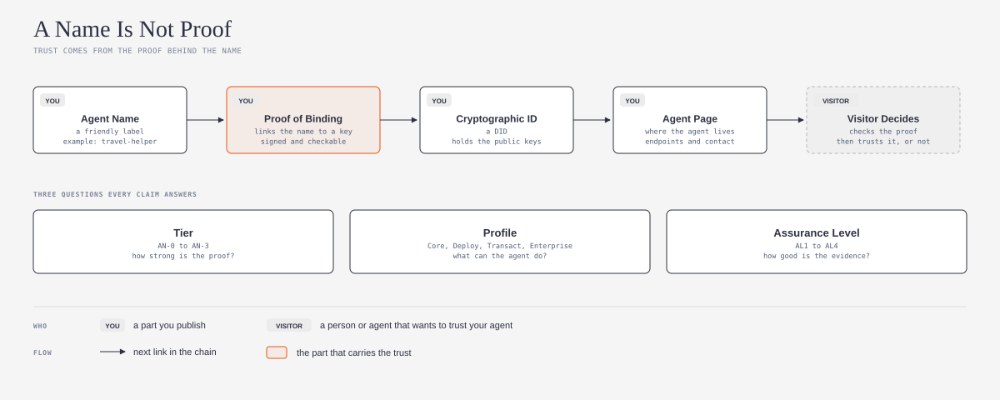
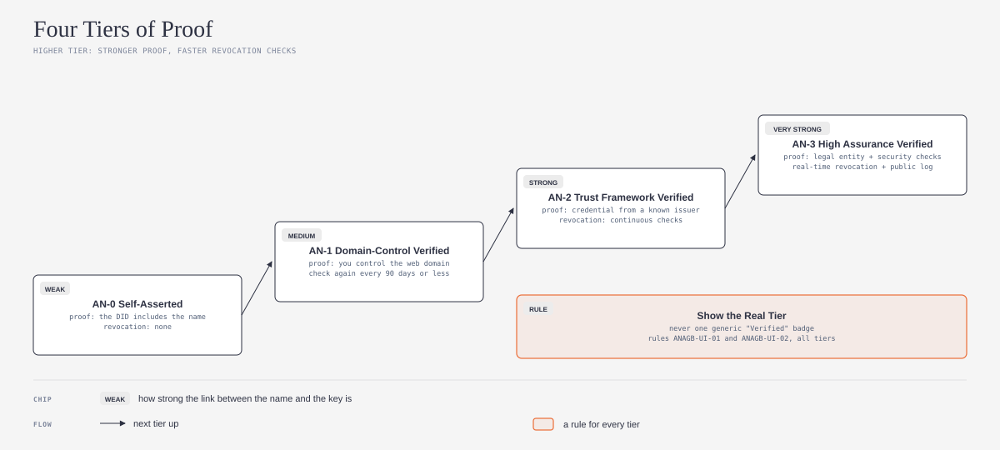
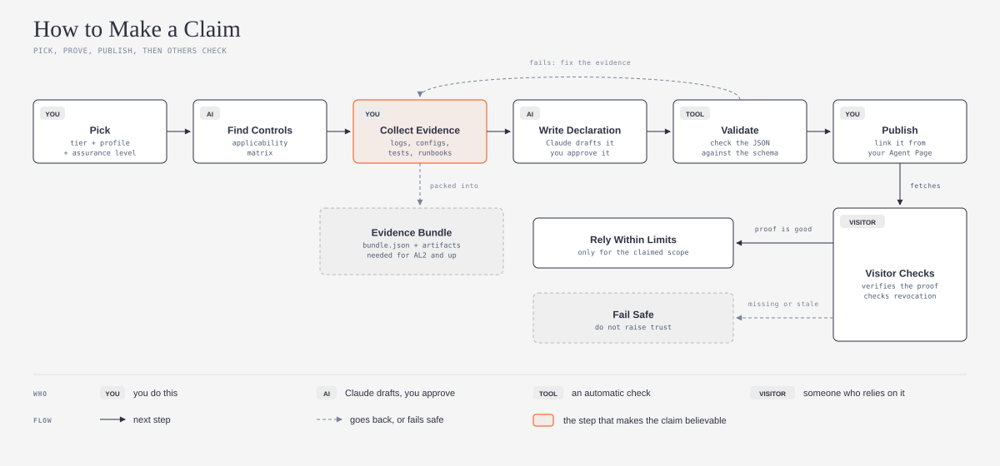

# agent-name-assurance-explained

## What is it?

This repository is a plain-language guide and an agent skill. Both are based on the Agent Name Assurance Baseline (ANAB), an open draft standard. ANAB tells you how to connect an agent name to a cryptographic key. It also tells you how to show the strength of that connection, and how to give evidence for it.

*Do you want the technical words in plain English? Refer to the [Jargon Buster](JARGON.md).*

## What problem does it solve?

A name is easy to copy. An attacker can make an agent with a name that looks almost the same as your name. Without proof, a person cannot see the difference. ANAB treats a name only as a hint. This guide shows you how to prove that the name is really yours, so that people and other agents can trust it.

## Who it is for

This guide is for vibe coders and other people who make AI agents but are not security specialists. You do not need to write code to use the skill. The skill uses the open [Agent Skills](https://agentskills.io) format (`SKILL.md`), so it works with Claude, Codex, GitHub Copilot, and other AI agents that support this format.

## Safe by default

1. **Read and draft first.** The skill reads your project and writes drafts. It does not change files, publish pages, or sign data before you approve.
2. **No secret keys in the chat.** The skill never asks for a private key or a password. Do not paste them into the chat.
3. **Honest results.** The skill tells you the tier that your evidence supports. It does not tell you the tier that you want.
4. **Your files stay yours.** The drafts go into your project folder. You can read, change, or delete them at any time.

## What it does

Ask your AI agent to check your agent against ANAB. The skill helps your AI agent to do these steps:

1. Find out what your agent does and who relies on it
2. Select a tier, a profile, and an assurance level
3. Make a list of the controls (rules) that apply to your agent
4. Find the evidence that you have, and the gaps
5. Write a draft conformance declaration
6. Show you what to put on your Agent Page

The skill also looks for three frequent mistakes. The first mistake is a generic "Verified" badge. The second mistake is a high tier with weak evidence. The third mistake is an agent that acts with more authority than you gave it.

## How it works

*The diagrams below use the visual language of [cathrynlavery/diagram-design](https://github.com/cathrynlavery/diagram-design):*

ANAB has four tiers. At AN-0, the agent only states its name.

At AN-1, you prove that you control the web domain. At AN-2, a known issuer gives a credential. At AN-3, a check confirms the legal entity behind the agent, and a public log records each change. One rule applies at all tiers: show the real tier, not one generic "Verified" badge.

To make a claim, you select your tier and profile. Then you collect evidence and write a declaration. A schema check finds errors before you publish. You then link the declaration from your Agent Page. A visitor reads the declaration and checks the proof. If the proof is missing or old, the visitor must not increase trust.

## How to install

First, make a folder with the name `agent-name-assurance`. Put `SKILL.md` from this repository in that folder. Then do the steps for your AI agent.

### Claude

1. In claude.ai or the Claude desktop app, make a zip file of the `agent-name-assurance` folder.
2. Upload the zip file in **Settings > Capabilities > Skills**.
3. In Claude Code, put the folder in `~/.claude/skills/agent-name-assurance/`.

### Codex

1. Put the folder in `~/.agents/skills/agent-name-assurance/` for all your projects.
2. Or, put the folder in `.agents/skills/agent-name-assurance/` in one project.
3. Or, tell Codex to use `$skill-installer` with the GitHub URL of this repository.
4. If the skill does not show, start Codex again. Source: [Codex skills documentation](https://learn.chatgpt.com/docs/build-skills).

### GitHub Copilot

1. Put the folder in `~/.copilot/skills/agent-name-assurance/` for all your projects.
2. Or, put the folder in `.github/skills/agent-name-assurance/` in one repository.
3. Use Copilot in agent mode. Source: [GitHub Copilot skills documentation](https://docs.github.com/en/copilot/how-tos/copilot-cli/customize-copilot/create-skills).

These three agents are the most used AI coding agents in the [JetBrains 2026 survey](https://blog.jetbrains.com/research/2026/08/ai-coding-agent-adoption-2026/). Other agents that support Agent Skills use the same `SKILL.md` file. Refer to the documentation of your agent for the folder.

## How to use it

After you install the skill, speak to your AI agent in your usual words:

- "Check my agent against the Agent Name Assurance Baseline"
- "Which ANAB tier can my agent get?"
- "Write a draft conformance declaration for my agent"

The skill starts automatically. You do not need to use its name.

## Credit and license

This guide is based on [agent-name-assurance-baseline](https://github.com/sankarshanmukhopadhyay/agent-name-assurance-baseline) by [Sankarshan Mukhopadhyay](https://github.com/sankarshanmukhopadhyay), version 0.10.0. That project uses the Apache License 2.0. This repository uses the same license. Refer to [LICENSE](LICENSE) and [NOTICE](NOTICE).

This is an independent plain-language guide. It is not an official part of the source project. For the full rules, use the source specification.

Changes from the source:

1. I wrote the main concepts again in Simplified Technical English, for readers who are not specialists.
2. I made three new diagrams.
3. I wrote an agent skill that applies the baseline to one agent.
4. I did not copy the specification, the schemas, or the tools. The skill refers to them by their file paths in the source repository.

---

*New words? The [Jargon Buster](JARGON.md) gives plain-English explanations of tier, profile, assurance level, evidence bundle, revocation, and more.*
